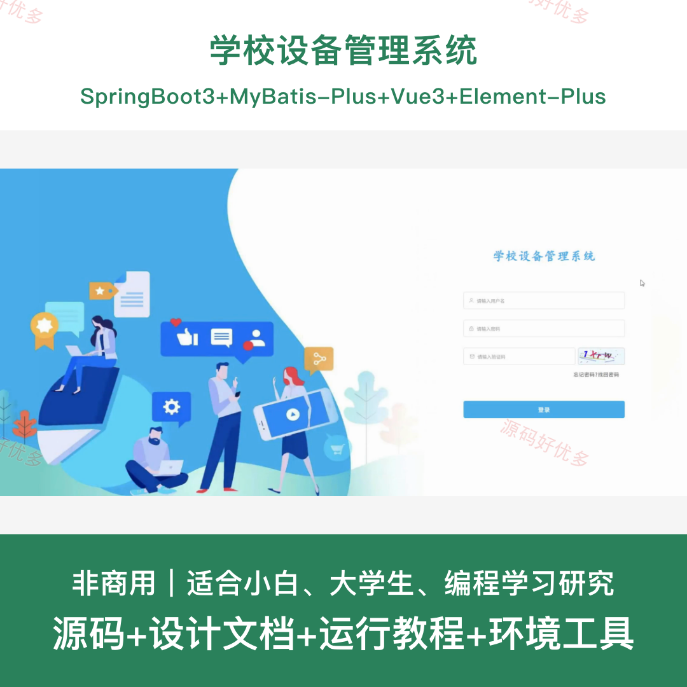
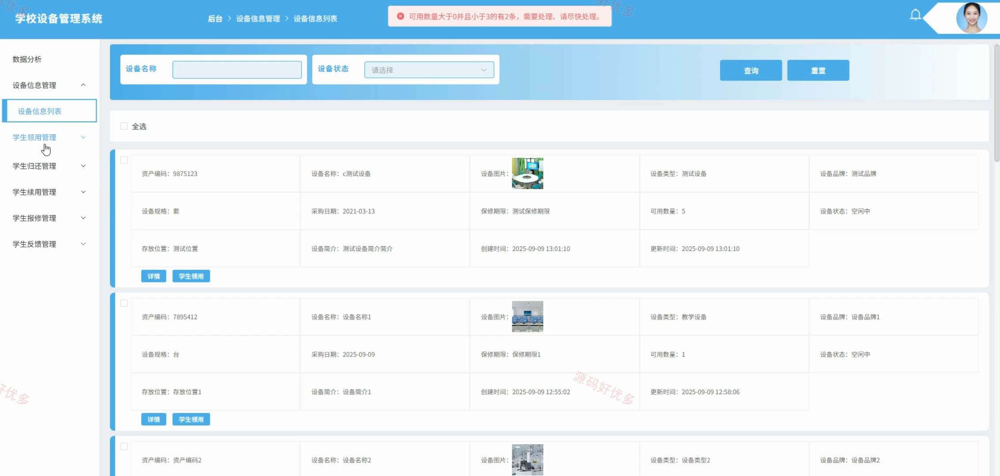
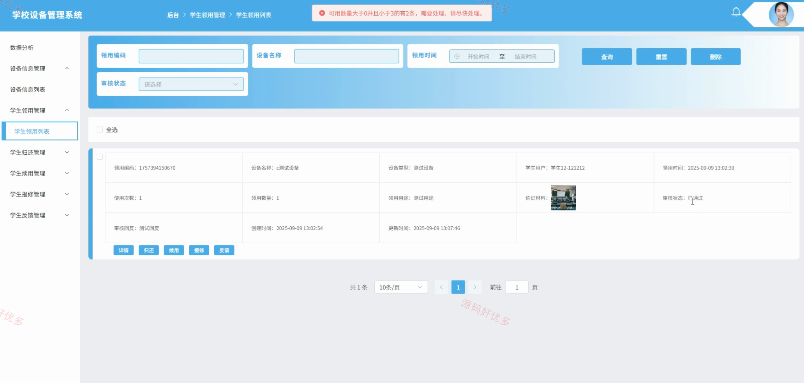
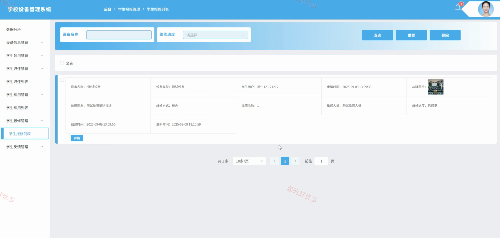
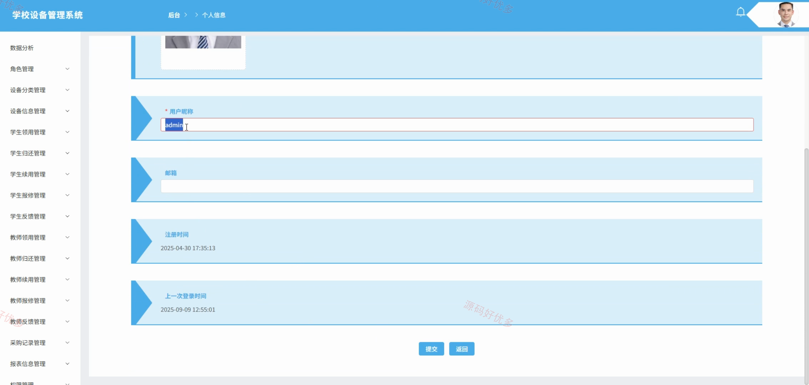
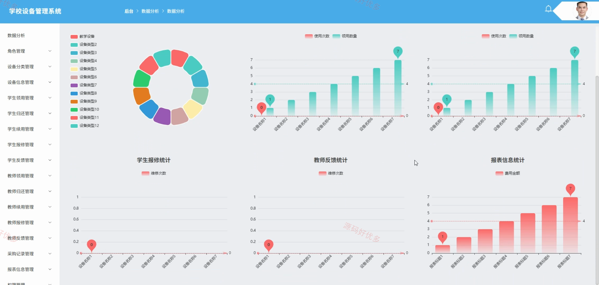
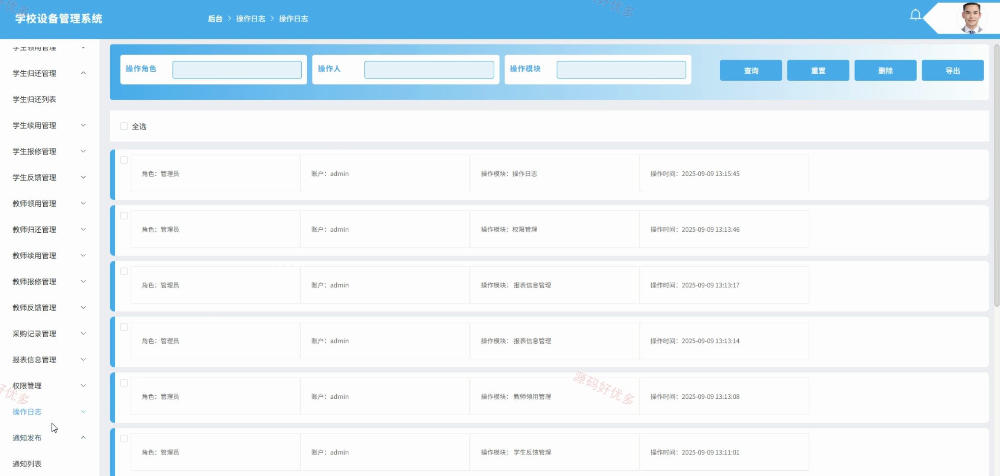
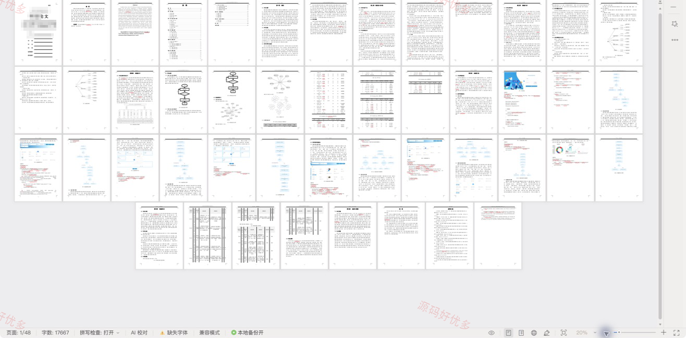

# springbootA607D
springbootA607D学校设备管理系统
## 源码问题查看主页咨询

### 一、关键词
学校设备管理系统、学校设备、学校设备信息管理、学校设备后台管理

### 二、作品包含
源码+数据库+设计文档+全套环境和工具资源+本地部署教程

### 三、项目技术
前端技术： Html、Css、Js、Vue3.4、Element-Plus
后端技术：Java、SpringBoot3.0.0、MyBatis-Plus

### 四、运行环境（以下版本亲测，其他版本兼容性请自行测试）
开发工具：IDEA/eclipse + VSCODE

数据库：MySQL8.0+（共26张表）

数据库管理工具：Navicat10以上版本

环境配置软件： JDK1.8 + Maven3.6.3

前端Nodejs：16+

浏览器：谷歌浏览器

### 五、项目介绍
项目编号：springbootA607D

学校设备管理系统面向管理员、学生、教师，提供项目核心业务等功能，实现各角色在系统中的实际业务协作。

角色：管理员、学生、教师

管理员功能：用户信息管理、设备分类管理、设备信息管理、设备领用记录管理、设备归还和续用记录管理、设备报修记录管理、采购记录与统计报表查看、通知与反馈管理。

学生功能：设备领用申请、设备归还登记、设备续用申请、设备故障报修、使用反馈提交。

教师功能：设备领用申请、设备归还登记、设备续用申请、设备故障报修、使用反馈提交。

### 六、运行截图

